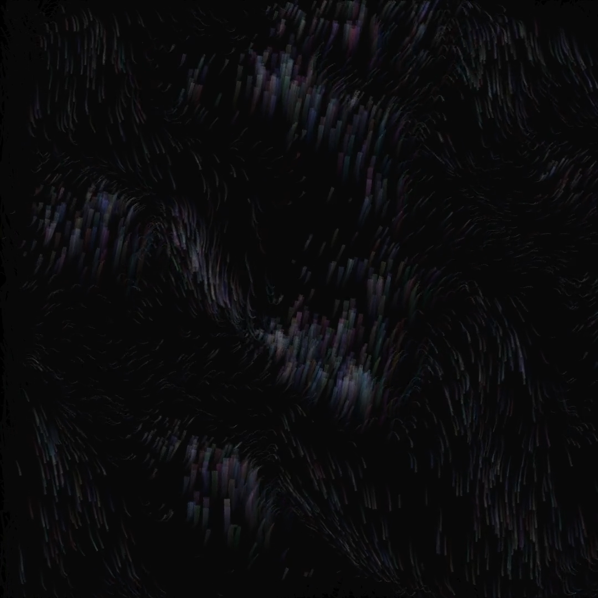

# Processing Sketches
A collection of processing sketches and experiments. This repo uses git lfs for images

## Running
Some of these sketches require or allow for command line arguments so it is recommended to [run these through the command line](https://github.com/processing/processing/wiki/Command-Line). An example might be
```bash
$ processing-java --sketch=/home/processingSketches/sketches/2020/brightnessShapes --run /home/imageToUse.png
```

## Sketches

### starRotate


### particleWave


### starRotate


## License
[](http://creativecommons.org/licenses/by-nc/4.0/)  
This work is licensed under a [Creative Commons Attribution-NonCommercial 4.0 International License](http://creativecommons.org/licenses/by-nc/4.0/).
